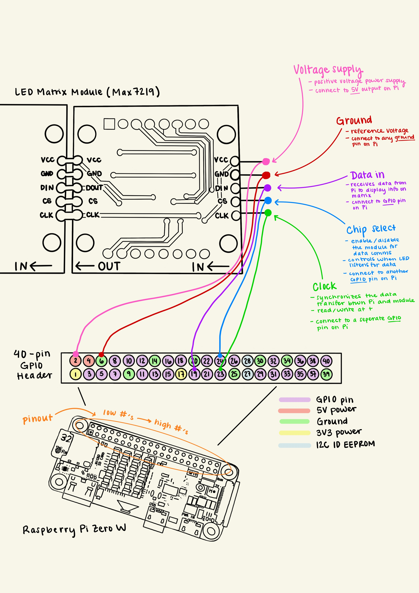
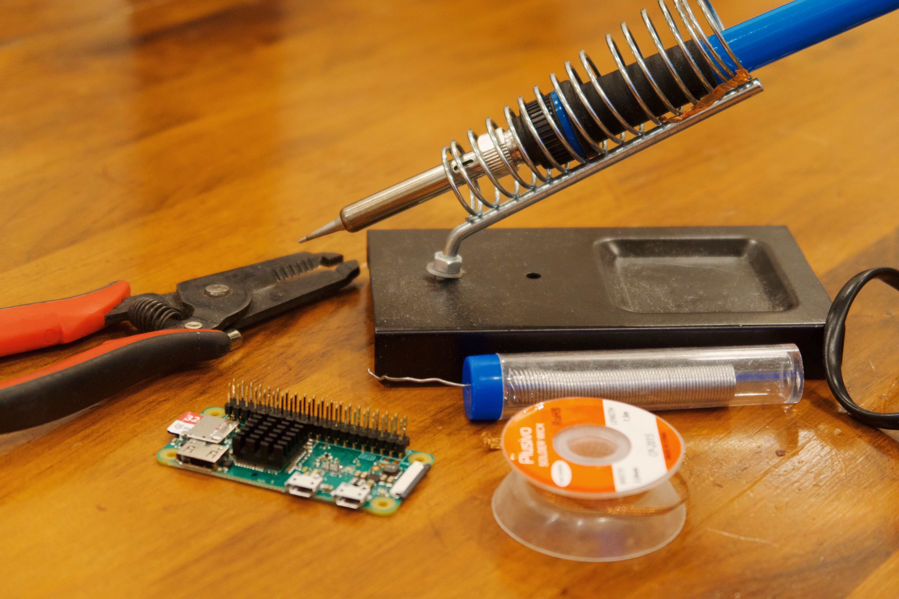

# Using a Raspberry Pi to display Q-train arrival time

## Materials

- Raspberry Pi Zero W or WH with a power supply
  - I chose the Pi Zero W because was affordable, wireless, and minimal. I bought [a starter kit on Amazon](https://www.amazon.com/gp/product/B0748MBFTS/ref=ppx_yo_dt_b_search_asin_title?ie=UTF8&psc=1) that included the power suppply and other accessories.
  - In hindsight, I wish I'd gotten [this kit](https://www.amazon.com/DIGISHUO-Pi-Zero-WH-Pre-Soldered/dp/B0BWT2CBJT/ref=sr_1_6?crid=ZA9CDEWRLORW&keywords=raspberry%2Bpi%2Bzero%2Bwh&qid=1697548570&sprefix=raspberry%2Bpi%2Bzero%2Bwh%2Caps%2C108&sr=8-6&ufe=app_do%3Aamzn1.fos.006c50ae-5d4c-4777-9bc0-4513d670b6bc&th=1) with a Raspberry Pi Zero WH with a [pre-soldered GPIO header](https://www.adafruit.com/product/3708). When I first started this project, I didn't realize the Zero W would require me to solder the pins myself.
- \>= 4GB MicroSD card
  - You can buy [one with the Raspberry Pi OS pre-installed](https://www.amazon.com/gp/product/B09VG5M4WV/ref=ppx_yo_dt_b_search_asin_title?ie=UTF8&psc=1) or install the [operating system](https://www.raspberrypi.com/software/) on a blank one.
- A display screen
  - I chose the [HiLetgo MAX7219 Dot Matrix Module](https://www.amazon.com/gp/product/B07FFV537V/ref=ppx_yo_dt_b_search_asin_title?ie=UTF8&psc=1). This came with 5 female-to-female jumper wires that connect the Pi to the display.

## Setup and Development

I documented setting up my Raspberry Pi with SSH [here](setup.md).

The MTA provides real time subway data via their [API](https://api.mta.info/#/subwayRealTimeFeeds). Each endpoint returns a GTFS blob, which is a compressed binary format based on protocol buffers specific to transfit schedules and looks something like this

```bash
A2A2#Èñ±©Èñ±©"R16N8Ê>
A2A2#¢ò±©¢ò±©"R15N8Ê>
A2A2#ó±©ó±©"R14N8Ê>
A2A2#°ô±©°ô±©"R13N8Ê>
G2G2#õ±©õ±©"R11N8Ê>
G2G2# ö±© ö±©"R60N8Ê>
D2D2#ã÷±©ã÷±©"G21N8Ê>
D2D2#êø±©êø±©"G20N8Ê>
D2D2#âù±©âù±©"G19N8Ê>
D2D2#¼ú±©¼ú±©"G18N8Ê>
```

To read the response, I used the `gtfs-realtime-bindings` library and parsed it as a `FeedMessage`.

```python
from google.transit import gtfs_realtime_pb2

feed = gtfs_realtime_pb2.FeedMessage()
response = requests.get(
  API_ENDPOINT, headers={"x-api-key": os.environ["MTA_API_KEY"]}
)
feed_json = feed.FromString(response.content)
for entity in feed_json.entity:
  ...

```

`feed_json` outputs a readable format where each `entity` is a distinct type of realtime data. In my case, each `entity` is a [trip update](https://developers.google.com/transit/gtfs-realtime/guides/trip-updates) consisting of one or more updates to vehicle stop times. Each [StopTimeUpdate](https://developers.google.com/transit/gtfs-realtime/reference#message-stoptimeupdate) is the realtime update for arrival and/or departure events for a given stop.

```bash
entity {
  id: "000047R"
  trip_update {
    trip {
      trip_id: "113950_R..S"
      route_id: "R"
      start_time: "18:59:30"
      start_date: "20231015"
    }
    stop_time_update {
      stop_id: "G08S"
      arrival {
        time: 1697410770
      }
      departure {
        time: 1697410770
      }
    }
```

To output the next arrival time of my local Q train, I had to first find the respective `stop_id` for my station. This took some digging through MTA docs, but I finally found the `stops.txt` file nested inside of the [New York City Transit Subway download link](http://web.mta.info/developers/data/nyct/subway/google_transit.zip). The `stops.txt` file contains the `stop_id`'s for all Subway stations and I found mine by searching for the street number.

To retrieve the relevant `StopTimeUpdate`, I iterated over each entity in the `feed_json` object and for each entity, iterated further through the `stop_time_update` objects within the `trip_update field`. When a `stop_time_update` was found where the `stop_id` matched my predefined `STOP_ID`, I appended the `stop_time_update` to a list.

```python
feed_json = feed.FromString(response.content)

stop_time_update_arrivals = [
    stop_time_update
    for entity in feed_json.entity
    for stop_time_update in entity.trip_update.stop_time_update
    if stop_time_update.stop_id == STOP_ID
]
```

## Running the program on the Raspberry Pi

Once I had the program working locally (i.e., printing `X min` in the terminal), it was time to test the functionality on the Raspberry Pi. I found a couple of approaches to do this:

1. Manually copy the files from local to Pi
2. Git clone repo in Pi
3. Use the `Remote - SSH` VSCode extension

I ultimately chose method #2, allowing me to edit the project locally and simply `git pull` on my Raspberry Pi to retrieve the latest version. Option #3 would have probably been ideal, but my Raspberry Pi's architecture is ARMv6l while the `Remote - SSH` VSCode extension only supports ARMv7l (AArch32) Raspbian Stretch/9+ (32-bit) or ARMv8l (AArch64) Ubuntu 18.04+ (64-bit).

> You can determine your Raspberry Pi's architecture by running `uname -m` in the shell

To setup the project on the Raspberry Pi -

1. In your local project once you've installed all the necessary packages, run `pip freeze > requirements.txt`. A `requirements.txt` file will be created, listing all the dependencies for your project.
2. Commit and push code to a Github repo.
3. SSH into the Raspberry Pi
4. Run `git clone <url>`. This creates a project directory on your Raspberry Pi. If the repo is private, you will need to enter your username and create a [Personal Access Token](https://docs.github.com/en/authentication/keeping-your-account-and-data-secure/managing-your-personal-access-tokens#creating-a-personal-access-token-classic) in Github to use as the password.
5. Create a Python virtual environment `python3 -m venv myenv`
   - Remember that your Raspberry Pi is not as powerful as your computer and this step may take a few minutes.
6. Activate the virtual environment `source myenv/bin/activate`
7. Copy your local `.env` to the Pi using the command. My `.env` file contains the MTA API key and my local `stop_id`. This command should be run outside of the Raspberry Pi shell.

```
scp path/to/your/local/.env pi@raspberry_pi_ip_address:/path/to/remote/directory
```

8. Run `pip install -r requirements.txt` to install all packages listed in the `requirements.txt` file.
9. Run `python3 main.py` to run the script
   

   Note: This is prior to adding the code to display the text on the dot matrix module and setting up the cron job.

## Connecting LED MAX7219 Display to Raspberry Pi

Given this was my first time working with a Raspberry Pi, I did a little bit of research first before attempting to connect my Pi to the MAX7219 Dot Matrix Module.

The MAX7219 Dot Matrix Module has 5 pins on the side labeled VCC, GND, DIN, CS, and CLK. Each pin has a purpose and needs to be wired to the [correct pin on the Raspberry Pi](https://pinout.xyz/pinout/pin19_gpio10/).

I made the following diagram to identify the wiring.


At this point I was ready to start wiring, but didn't realize that I'd boughten a Raspberry Pi model that would require me to solder the 40-pin GPIO header to the Pi myself. In hindsight, I should've bought the Zero WH with a pre-soldered GPIO header. I have never soldered something, but decided to give it an attempt.

I posted my plea in a local Buy Nothing Facebook group and a kind neighbor lent me all the necessary equipment! You just need a soldering iron, solder wire, and desoldering wick in case you make a mistake.


I learned how to solder with [this YouTube video](https://www.youtube.com/watch?v=8Z-2wPWGnqE). I prepped my workspace, set up shop near an open window, and wore an n95 mask and bluelight glasses as makeshift googles.



The results were not perfect, but they worked!


I tested the connection of my soldering job by connecting the wires the LED display, which promptly lit up.

To control the display, I decided to work with SPI. Once the LED display is wired to the Raspberry Pi, SSH into your Raspberry Pi and run `sudo raspi-config` to enable the SPI interface. Navigate to "Interfacing Options" > "SPI" and enable SPI. Reboot your Pi with `sudo reboot` after making any changes.


To display text, I used the [Luma library](https://luma-led-matrix.readthedocs.io/en/latest/python-usage.html#x8-led-matrices), a display driver for the MAX7219. I also found that the `LCD_FONT` was the perfect font face and size for my 8x8 module.

```python
from luma.led_matrix.device import max7219
from luma.core.interface.serial import spi, noop
from luma.core.legacy import text
from luma.core.legacy.font import proportional, LCD_FONT
from luma.core.render import canvas
...
def display_minutes(minutes):
    serial = spi(port=0, device=0, gpio=noop())
    device = max7219(
        serial,
        cascaded=4,
        block_orientation=90,
        rotate=0,
        blocks_arranged_in_reverse_order=True,
    )

    message = f"{minutes} MIN"

    with canvas(device) as draw:
        text(draw, (3, 1), message, fill="white", font=proportional(LCD_FONT))
```

To setup a cron job (i.e., enable your code to run on a schedule), SSH into your Raspberry Pi and run `sudo crontab -e` to open the Crontab for editing. Inside the crontab file, add the desired cron job entry to schedule the Python script.

> Note: the `sudo` in `sudo crontab -e` will set the cron job for the root user.

```
* * * * * /home/sophiashovkovy/raspberry-train/myenv/bin/python /home/sophiashovkovy/raspberry-train/main.py >> /home/sophiashovkovy/cron.log 2>&1

```

This line schedules the job to run every minute. It includes a path to the Python interpreter that will be used to run the script and a path to the Python script that will be excuted by the cron job.

`>> /home/sophiashovkovy/cron.log 2>&1` redirects the stdout and stderr of the cron job to a log file that I can review when debugging.


## Helpful Resources

- [MTA subway realtime feed](https://api.mta.info/#/subwayRealTimeFeeds) (must be signed-in to view)
- [GTFS Python example](https://developers.google.com/transit/gtfs-realtime/examples/python-sample)
- [Raspberry Pi Zero W Pinout](https://pinout.xyz/pinout/pin19_gpio10/)
- [Luma driver for MAX7219](https://luma-led-matrix.readthedocs.io/en/latest/python-usage.html#x8-led-matrices)
