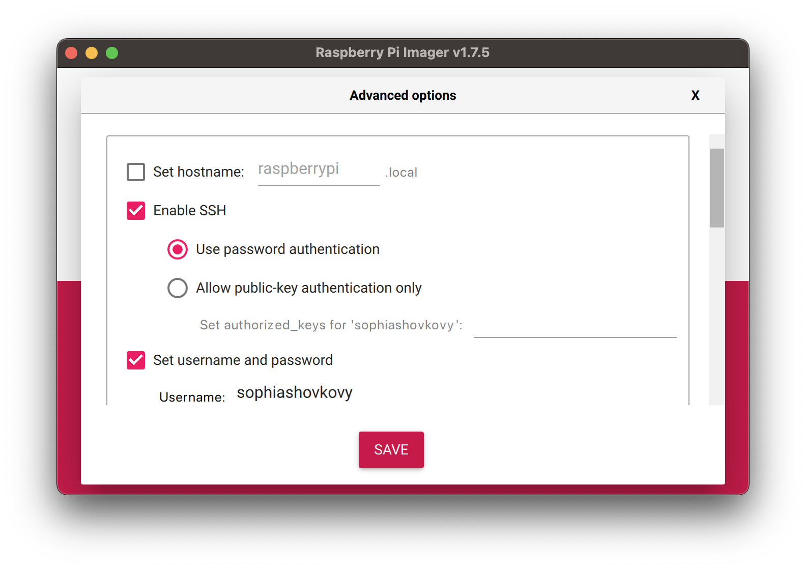
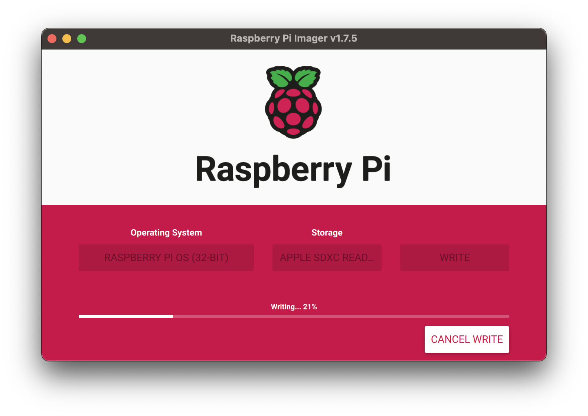
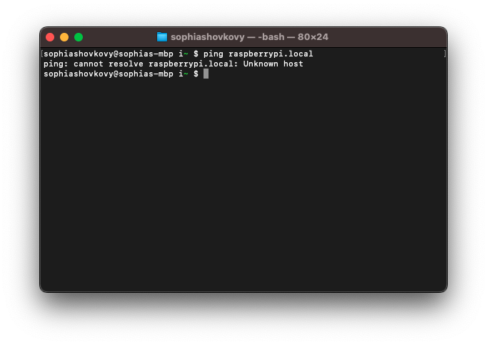

## Enable SSH on a Raspberry Pi (and connect via IP)

Flash SD card using [Raspberry Pi Imager](https://www.raspberrypi.com/software/). Advanced settings are not required, but I enabled SSH and set a username and password


  Note: `write` will erase everything on the SD card


In the root directory of the SD card, run `touch ssh` to create an empty file `ssh`
In the root directory, create a file called `wpa_supplicant.conf` with the following code and fill out your network details

```bash
ctrl_interface=DIR=/var/run/wpa_supplicant GROUP=netdev
update_config=1
country=<US>
network={
 ssid="WIFI_NAME"
 psk="WIFI_PASSWORD"
}
```


Safely eject the SD card, insert into the Raspberry Pi, power on and wait to boot (steady light). Ping Pi for IP address with `ping raspberrypi.local`



I got no response, but the `arp -a` command did reveal a `raspberrypi.lan (192.168.86.250)`. I ping'd `ping raspberrypi.lan` and received a response. I was able to SSH into it with `ssh sophiashovkovy@xxx.xxx.xx.xxx`. The default hostname that was configured in the Raspberry Pi Imager is `raspberrypi`, so I can also ssh in with `ssh sophiashovkovy@raspberrypi`
